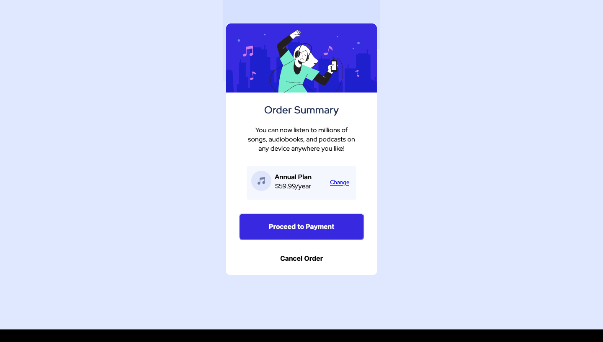

# Frontend Mentor - Order summary card solution

This is a solution to the [Order summary card challenge on Frontend Mentor](https://www.frontendmentor.io/challenges/order-summary-component-QlPmajDUj). Frontend Mentor challenges help you improve your coding skills by building realistic projects.

## Table of contents

- [Frontend Mentor - Order summary card solution](#frontend-mentor---order-summary-card-solution)
  - [Table of contents](#table-of-contents)
  - [Overview](#overview)
    - [The challenge](#the-challenge)
    - [Screenshot](#screenshot)
    - [Links](#links)
  - [My process](#my-process)
    - [Built with](#built-with)
    - [What I learned](#what-i-learned)
    - [Continued development](#continued-development)
    - [Useful resources](#useful-resources)
  - [Author](#author)

## Overview

### The challenge

Users should be able to:

- See hover states for interactive elements

### Screenshot



### Links

- Solution URL: (https://github.com/TorCanHack/Order-summary-card)
- Live Site URL: (https://torcanhack.github.io/Order-summary-card/)

## My process

### Built with

- Semantic HTML5 markup
- CSS custom properties
- Mobile-first workflow

### What I learned

In my previous README for one of the challenges I completed. I noted that I was going to pay more attention to Mobile-first workflow for the important reason that the majority of web usage comes from mobile phones. A stat that is increasingly rising.

I started with that approach in this challenge and now I see the pratical wisdom behind the principle.

After I completed the mobile design, I needed to alter the background for larger screens and I used the background-image property in css. However the image repeated and it was out of sync with the design. This led me to do  some research and I discovered how to stop a background-image from repeating -one of the joys of being a web developer is these little problem solving hunts that yield knowledge and practical know-how :D.

The following snippet shows how:

````css
body {
  background-repeat: no repeat;
}
````

Quite straight foward yeah?

**it is important to state that the background-repeat property has 3 other values that lets you control the direction and flow of the repeat should you need to repeat the image. For the purposes of this challange I did not need to repeat the background-image**

### Continued development

While thinking of the best way to optimize for src attribute of the img tag. I discovered the term Content Delivery Network (CDN). I would like to experiment with CDN in one of upcoming projects as I prepare to upscale.

### Useful resources

- [CSS Background Image – With HTML Example Code](https://www.freecodecamp.org/news/css-background-image-with-html-example-code/) - This helped me to understand how to stop a background image from reapeating, and how to direct the pattern when you want a background image to repeat.

## Author

- Frontend Mentor - [@torCanHack](https://www.frontendmentor.io/profile/torCanHack)
- Twitter - [@pairofbrains](https://www.twitter.com/pairofbrains)
